```mermaid
erDiagram
    CUSTOMER {
        uuid id PK
        string logto_sub
        string phone
        string full_name
        string email
        string avatar_url
        string birthday
        string membership_level
        int total_points
        datetime last_login
        boolean is_verified
        boolean is_suspended
        boolean needs_skill_setup
        datetime created_at
        datetime updated_at
    }

    CUSTOMER_SKILL_LEVEL {
        uuid customer_id FK
        string court_type_id
        string skill_level
    }

    PARTNER {
        uuid id PK
        string logto_sub
        string email
        string phone
        string avatar_url
        string role
        string partner_id
        uuid branch_id
        string full_name
        string status
        boolean is_suspended
        boolean is_verified
        datetime created_at
        datetime updated_at
    }

    BRANCH {
        uuid id PK
        string customer_id
        string name
        string address
        string phone
        datetime open_time
        datetime close_time
        boolean active
        boolean is_deleted
        string province
        string district
        string city
        double latitude
        double longitude
        string logo
        string thumbnail
        string slug
        string court_type_ids
        text description
        datetime created_at
        datetime updated_at
    }

    BRANCH_IMAGE {
        uuid branch_id FK
        string image_url
    }

    COURT_TYPE {
        uuid id PK
        string name
        string icon
        string color
        datetime created_at
        datetime updated_at
    }

    SKILL_LEVEL {
        uuid id PK
        uuid court_type_id FK
        string name
        text description
        string color
        datetime created_at
        datetime updated_at
    }

    COURT {
        uuid id PK
        uuid branch_id FK
        uuid type_id FK
        string name
        string status
        string description
        datetime created_at
        datetime updated_at
    }

    PRICE_RULE {
        uuid id PK
        uuid branch_id FK
        uuid court_type_id FK
        time start_time
        time end_time
        double price
        boolean is_default
        datetime created_at
        datetime updated_at
    }

    PRICE_RULE_DAY {
        uuid price_rule_id FK
        int day
    }

    BOOKING {
        uuid id PK
        uuid branch_id FK
        string customer_id
        string customer_name
        string phone
        datetime booking_date
        string note
        string payment_method
        string status
        string payment_status
        string source
        string created_by
        decimal total_price
        decimal deposit_amount
        decimal remaining_amount
        string cancellation_reason
        datetime created_at
        datetime updated_at
    }

    BOOKING_SLOT {
        uuid id PK
        uuid booking_id FK
        uuid court_id FK
        datetime start_time
        datetime end_time
        decimal price
        string status
        datetime created_at
        datetime updated_at
    }

    REVIEW {
        uuid id PK
        uuid branch_id FK
        string customer_id
        string comment
        double score
        datetime created_at
        datetime updated_at
    }

    ITEM_CATEGORY {
        uuid id PK
        string name
        string description
        string icon
        string color
        int display_order
        boolean is_active
    }

    ITEM {
        uuid id PK
        string owner_id
        uuid category_id FK
        string name
        boolean is_rental
        string unit
        string image_url
        boolean is_active
        string description
        datetime created_at
        datetime updated_at
    }

    BRANCH_ITEM {
        uuid id PK
        uuid branch_id FK
        uuid item_id FK
        decimal price
        int stock_quantity
        string status
        datetime created_at
        datetime updated_at
    }

    BOOKING_ITEM {
        uuid id PK
        uuid booking_id FK
        uuid branch_item_id FK
        int quantity
        decimal price_at_booking
        string status
        datetime created_at
        datetime updated_at
    }

    TEAM_POST {
        uuid id PK
        uuid booking_id
        string user_id
        string email
        string full_name
        string phone
        uuid court_type_id
        string start_time
        string end_time
        int missing_count
        double cost_per_person
        string gender_constraint
        string age_constraint
        string role
        text notes
        string status
        datetime created_at
        datetime updated_at
    }

    TEAM_POST_APPLICANT {
        uuid id PK
        uuid team_post_id
        string user_id
        string email
        string full_name
        string phone
        text message
        string status
        datetime created_at
        datetime updated_at
    }

    TEAM_POST_DESIRED_SKILL {
        uuid team_post_id FK
        uuid skill_level_id FK
    }

    PAYMENT {
        uuid id PK
        string booking_id
        string owner_id
        decimal amount
        string payment_method
        string status
        string gateway_transaction_no
        datetime created_at
        datetime updated_at
    }

    PAYMENT_LOG {
        uuid id PK
        uuid payment_id FK
        string log_type
        text payload
        datetime created_at
        datetime updated_at
    }

    OWNER_WALLET {
        uuid id PK
        string owner_id
        decimal pending_balance
        decimal available_balance
        decimal locked_balance
        datetime created_at
        datetime updated_at
    }

    WALLET_TRANSACTION {
        uuid id PK
        uuid wallet_id FK
        decimal amount
        string transaction_type
        string reference_type
        string reference_id
        string description
        datetime created_at
        datetime updated_at
    }

    OWNER_BANK_ACCOUNT {
        uuid id PK
        string owner_id
        string bank_name
        string account_number
        string account_name
        boolean is_default
        datetime created_at
        datetime updated_at
    }

    PAYOUT_REQUEST {
        uuid id PK
        uuid wallet_id FK
        uuid bank_account_id FK
        decimal amount
        string status
        string approved_by
        string approved_by_name
        string rejection_reason
        datetime created_at
        datetime updated_at
    }

    NOTIFICATION_TEMPLATE {
        uuid id PK
        string code
        string type
        string subject_template
        text body_template
        json metadata
        datetime created_at
        datetime updated_at
    }

    NOTIFICATION {
        uuid id PK
        string source_service
        string event_type
        string template_code
        string title
        text message
        json payload
        string recipient_type
        json recipient_ids
        string status
        datetime created_at
    }

    NOTIFICATION_LOG {
        uuid id PK
        uuid notification_id FK
        string user_id
        string channel
        string status
        json provider_response
        text error_message
        int retry_count
        datetime sent_at
        datetime read_at
        datetime created_at
    }

    USER_DEVICE {
        uuid id PK
        string user_id
        string branch_id
        text fcm_token
        string device_type
        boolean is_active
        datetime last_active_at
    }

    GALLERY_IMAGE {
        uuid id PK
        string url
        string public_id
        string owner_id
        string uploader_id
        string original_filename
        string format
        int width
        int height
        long bytes
        boolean is_deleted
        datetime created_at
        datetime updated_at
    }

    NEWS_ARTICLE {
        uuid id PK
        string title
        string slug
        text description
        text content_html
        json content_json
        json schema_json
        string seo_title
        string seo_description
        text featured_image_url
        string featured_image_public_id
        string featured_image_alt
        string status
        datetime published_at
        string created_by
        string updated_by
        boolean is_deleted
        int reading_time
        long view_count
        string author_name
        text tags
        string category
        datetime created_at
        datetime updated_at
    }

    BRANCH_DOCUMENT {
        string id PK
        string branch_id
        string name
        string address
        string province
        string district
        string city
        string slug
        double latitude
        double longitude
        int total_courts
        boolean active
    }

    TEAM_POST_DOCUMENT {
        string id PK
        string team_post_id
        string booking_id
        string branch_id
        string user_id
        string court_type_id
        string status
    }

    CUSTOMER ||--o{ CUSTOMER_SKILL_LEVEL : has
    CUSTOMER ||--o{ BOOKING : books
    CUSTOMER ||--o{ REVIEW : writes
    CUSTOMER ||--o{ TEAM_POST : creates
    CUSTOMER ||--o{ TEAM_POST_APPLICANT : applies
    CUSTOMER ||--o{ USER_DEVICE : registers
    CUSTOMER ||--o{ GALLERY_IMAGE : uploads

    PARTNER ||--o{ BRANCH : owns
    PARTNER ||--o{ OWNER_WALLET : has
    PARTNER ||--o{ OWNER_BANK_ACCOUNT : owns
    PARTNER ||--o{ ITEM : owns

    BRANCH ||--o{ BRANCH_IMAGE : has
    BRANCH ||--o{ COURT : has
    BRANCH ||--o{ PRICE_RULE : has
    BRANCH ||--o{ BOOKING : receives
    BRANCH ||--o{ REVIEW : receives
    BRANCH ||--o{ BRANCH_ITEM : stocks
    BRANCH ||--o{ PARTNER : staffs

    COURT_TYPE ||--o{ SKILL_LEVEL : defines
    COURT_TYPE ||--o{ COURT : categorizes
    COURT_TYPE ||--o{ PRICE_RULE : prices
    COURT_TYPE ||--o{ TEAM_POST : requested_for

    PRICE_RULE ||--o{ PRICE_RULE_DAY : applies_on

    COURT ||--o{ BOOKING_SLOT : reserved_by
    BOOKING ||--o{ BOOKING_SLOT : includes
    BOOKING ||--o{ BOOKING_ITEM : includes
    BOOKING ||--o{ TEAM_POST : creates
    BOOKING ||--o{ PAYMENT : paid_by

    ITEM_CATEGORY ||--o{ ITEM : classifies
    ITEM ||--o{ BRANCH_ITEM : listed_at
    BRANCH_ITEM ||--o{ BOOKING_ITEM : booked_as

    TEAM_POST ||--o{ TEAM_POST_APPLICANT : receives
    TEAM_POST ||--o{ TEAM_POST_DESIRED_SKILL : requires
    SKILL_LEVEL ||--o{ TEAM_POST_DESIRED_SKILL : selected

    PAYMENT ||--o{ PAYMENT_LOG : logs
    OWNER_WALLET ||--o{ WALLET_TRANSACTION : records
    OWNER_WALLET ||--o{ PAYOUT_REQUEST : withdraws
    OWNER_BANK_ACCOUNT ||--o{ PAYOUT_REQUEST : destination

    NOTIFICATION_TEMPLATE ||--o{ NOTIFICATION : renders
    NOTIFICATION ||--o{ NOTIFICATION_LOG : sends

    BRANCH ||--|| BRANCH_DOCUMENT : indexed_as
    TEAM_POST ||--|| TEAM_POST_DOCUMENT : indexed_as
    BOOKING ||--o{ TEAM_POST_DOCUMENT : denormalized_from
    BRANCH ||--o{ TEAM_POST_DOCUMENT : denormalized_from
```

# syncfilekltn

```
netsh interface portproxy add v4tov4 listenport=80 listenaddress=0.0.0.0 connectport=80 connectaddress=127.0.0.1
netsh interface portproxy add v4tov4 listenport=443 listenaddress=0.0.0.0 connectport=443 connectaddress=127.0.0.1
```

```
# Mở cổng 80 cho lưu lượng HTTP
New-NetFirewallRule -DisplayName "Allow HTTP (Port 80)" `
    -Direction Inbound `
    -LocalPort 80 `
    -Protocol TCP `
    -Action Allow `
    -Profile Any `
    -Description "Cho phep luu luong HTTP di vao Traefik"

# Mở cổng 443 cho lưu lượng HTTPS (Let's Encrypt & React Native API)
New-NetFirewallRule -DisplayName "Allow HTTPS (Port 443)" `
    -Direction Inbound `
    -LocalPort 443 `
    -Protocol TCP `
    -Action Allow `
    -Profile Any `
    -Description "Cho phep luu luong HTTPS an toan di vao Traefik"
```


